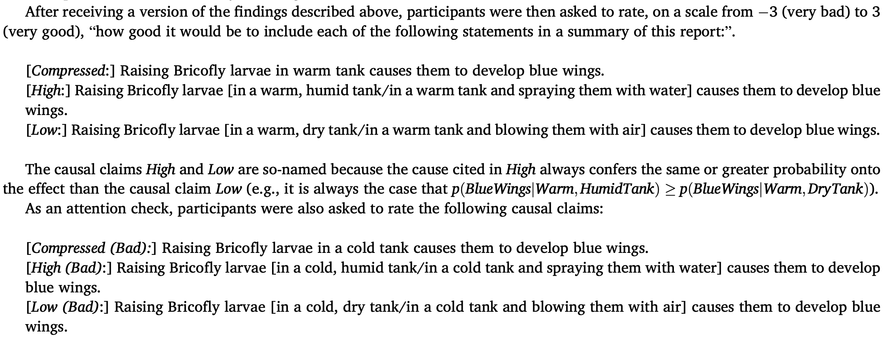

```{r imports}
#| code-summary: "Imports"

library(tidyverse)
library(afex)
library(glue)
library(brms)
library(loo)
library(knitr)
library(faintr)
library(cspplot)
library(patchwork)

# these options help Stan run faster
options(mc.cores = parallel::detectCores(), brms.backend = "cmdstanr")

# use the CSP-theme for plotting
theme_set(theme_csp())

# global color scheme from CSP
project_colors <- cspplot::list_colors() |> pull(hex)

# setting theme colors globally
scale_colour_discrete <- function(...) {
  scale_colour_manual(..., values = project_colors)
}

scale_fill_discrete <- function(...) {
  scale_fill_manual(..., values = project_colors)
}
```


We are exploring different ways to formally define **Causal Relevance**

$$CS(C,S)$$
where $S$ is a sentence in context $C$.

# Causal Mutual Information Measures

Causal mutual information is defined as:
$$cMI (X,Y) = \sum_{x,y}q(x)p(y\mid do(x))\log_2\frac{p(y\mid do(x))}{p(y)}$$

Kinney and Lombrozo (2024) assume that all variables are intervened on, and as such the intervention prior is flat. The effect $Y$ is binary, e.g. blue wings/not blue wings. For the sake of generality let $Y=\{0,1\}$. We can then write:

$$cMI (X,Y) = \frac{1}{|X|} \left(\sum_{x}p(Y=1\mid do(x))\log_2\frac{p(Y=1\mid do(x))}{p(Y=1)} +\sum_{x}p(Y=0\mid do(x))\log_2\frac{p(Y=0\mid do(x))}{p(Y=0)} \right),$$

which corresponds to how `cMI` is calculated in the code below and closely mirrors the computation shown in Kinney and Lombrozo (2024).
```{r cMI}
#| code-fold: false
cMI <- function(probs, grouping) {
  grouped_probs <- sapply(split(probs, grouping), mean)

  probs1 <- grouped_probs # probabilities that, e.g. Bricofly will develop blue wings
  probs0 <- 1 - grouped_probs # probabilities that, e.g. Bricofly will **not** develop blue wings

  q_c <- 1 / length(probs1) #q(c) is simply a constant, since q is a uniform probability distribution

  p1 <- 1 / length(probs1) * sum(probs1) # P(E=1)
  p0 <- 1 / length(probs0) * sum(probs0) # P(E=0)

  q_c * (sum(probs1 * log2(probs1 / p1)) + sum(probs0 * log2(probs0 / p0)))
}
```

### KL's Compressed Causal Models

$$CS_{KL}(C,S) = cMI(X,Y)-cMI(X_s,Y)$$
$X_s$ may be a null compression, in which case the measure simplifies to $CS_{KL}(C,S) = CMI(X,Y)$.

```{r KL}
#| code-fold: false
KL_CS <- function(probs, uncompressed_grouping, compressed_grouping = NULL) {
  # special case: null compression
  if (is.null(compressed_grouping)) {
    return(cMI(probs, uncompressed_grouping))
  }

  cMI(probs, uncompressed_grouping) - cMI(probs, compressed_grouping)
}
```

### MF's Causal Compression for Communciation

$$CS_{MF}(C,S) = \sum_{i}w_i\:cMI(X_i,Y)$$
```{r MF}
#| code-fold: false
MF_CS <- function(probs, grouping_list, weights = c(1)) {
  sum(weights * vapply(grouping_list, \(g) cMI(probs, g), numeric(1)))
}
```

Sentence S semantically denotes a partition of subsets of a subset of variables. For example, **high** sentence from Experiment 1 below, assuming X is a four-way categorical variable, can have partitioning $$\llbracket S_{high}\rrbracket = \{\{x_1\},\{x_2\},\{x_3\},\{x_4\}\},$$ referred to as `finest` below, or
$$\llbracket S_{high} \rrbracket = \{\{x_1\},\{x_2,x_3,x_4\}\},$$
referred to as `one_vs_rest` below. The same goes for **low** sentences in Experiment 1, which also could be represented by either of the two partitions $\llbracket S_{low}\rrbracket = \{\{x_1\},\{x_2\},\{x_3\},\{x_4\}\}$ and $\llbracket S_{low} \rrbracket = \{\{x_2\},\{x_1,x_3,x_4\}\}.$

The grouping arguments in `cMI`, `KL_CS`, and `MF_CS` allow us to define the desired granularity. For example, comparing `finest` and `one_vs_rest` in `KL_CS` in the $x=85$ situation gives us:

```{r granularity-comparison}
#| code-fold: false
tibble(
  granularity = c("finest", "one_vs_rest"),
  KL_CS = c(
    KL_CS(c(.85, .7, .01, .01), c(1, 2, 3, 4)) |> round(2),
    KL_CS(c(.85, .7, .01, .01), c(1, 2, 2, 2)) |> round(2)
  )
) |>
  kable()
```

Kinney and Lombrozo (2024) use **only *finest* representations** in their model (see, for example, that the result for finest above corresponds to the calculation in footnote 10 in KL (2024)), meaning that for their measure it holds that $\llbracket S_{high} \llbracket = \{\{x_1\},\{x_2\},\{x_3\},\{x_4\}\} = \llbracket S_{low} \rrbracket.$

More concretely, when $\llbracket S_{high} \rrbracket = \{\{x_1\},\{x_2\},\{x_3\},\{x_4\}\},$ we are putting $\{x_1\}$ up against $\{x_2\},\{x_3\},\{x_4\},$ in which case $CS(C,S_{high})$ equals:

```{r}
#| code-fold: false
# (We have four groups and no way to pick out x_1, which is in group 1)
KL_CS(c(.85, .7, .01, .01), c(1, 2, 3, 4)) |> round(2)
```

When $\llbracket S_{low} \rrbracket = \{\{x_1\},\{x_2\},\{x_3\},\{x_4\}\},$ we are putting $\{x_2\}$ up against $\{x_2\},\{x_3\},\{x_4\},$ in which case $CS(C,S_{low})$ equals:

```{r}
#| code-fold: false
# (We have four groups and no way to pick out x_2, which is in group 2)
KL_CS(c(.85, .7, .01, .01), c(1, 2, 3, 4)) |> round(2)
```

As we can see, $CS_{KL}$ **cannot differentiate** between $S_{high}$ and $S_{low}$ **when using the *finest* representation**.

However, when we switch from using the `finest` representation in $CS_{KL}$ to the `one_vs_rest` representation **the situation changes and we can differentiate between the two**.

When $\llbracket S_{high} \rrbracket = \{\{x_1\},\{x_2,x_3,x_4\}\},$ we are putting $\{x_1\}$ up against $\{x_2,x_3,x_4\},$ in which case  $CS(C,S_{high})$ equals:

```{r}
#| code-fold: false
# (We have two groups, x_1 is in group 1)
KL_CS(c(.85, .7, .01, .01), c(1, 2, 2, 2)) |> round(2)
```

When $\llbracket S_{low} \rrbracket = \{\{x_2\},\{x_1,x_3,x_4\}\},$ we are putting $\{x_2\}$ up against $\{x_1,x_3,x_4\},$ in which case  $CS(C,S_{low})$ equals:

```{r}
#| code-fold: false
# (We have two groups, x_2 is in group 2)
KL_CS(c(.85, .7, .01, .01), c(1, 2, 1, 1)) |> round(2)
```


$CS_{MF}$ combines the two representations and so for $S_{high}$, with a probabilistic weight $p$ and we get:

$$CS(C,S_{high}) = p \: cMI(\{\{x_1\},\{x_2\},\{x_3\},\{x_4\}\}, Y) + (1-p) \: cMI(\{\{x_1\},\{x_2,x_3,x_4\}\}, Y).$$

# Note on causal selection models from causal cognition literature

NSM and CESM are both worked out for the same kind of causal model: an unsheilded collider where the relationship between cause and effect is deterministic and cause variables have probabilistic priors.
Our goal is to use these measures generally to assign a causal relevance value to a pair of cause and effect. For the vignettes in Kinney and Lombrozo (2024), we specifically have two situations. The model for proportionality is a simple chain with singular cause and effect variables. For stability, the model has two causes modelled separately; however, the causal claims made in this case are regarding either two values of a singular cause (proportionality) or TODO (stability).

One challenge is that in their vignettes, the cause variable is not binary for the proportionality case; we instead have four values. Another challenge is that in their vignettes, the relationship between cause and effect variables is not deterministic --- for a given condition of the tank, we are given a percentage of larvae, and so the probabilities for the effect variable are conditional probabilities given by the report. This is the same assumption made for the measures based on mutual information above. Similarly, all these measures assume exogeneity (no confounding), i.e $P(y\mid do(x)) = P(y\mid x)$.

The probability with which each tank condition comes about was not specified; the report simply mentioned conditional probabilities of the effect for all. We therefore assume a flat prior.


# Necessity-sufficiency models


## Probability of necessity and sufficiency (PNS) (Pearl, 2009)

### Computing necessity and sufficiency via a probabilistic analysis of counterfactuals
From Pearl (2009):

> **Definition 9.2.1 (Probability of Necessity, PN)** \
Let X and Y be two binary variables in a causal model M. Let x and y stand (respectively) for the propositions X = true and Y = true, and let x' and y' denote their complements.
The probability of necessity is defined as the expression $$PN \triangleq P(y'_{x'}\mid x,y)$$
\ \ ($B_{A}$ here is the counterfactual 'B if it were A')

> **Definition 9.2.2 (Probability of Sufficiency, PS)**\
$$PS \triangleq P(y_{x}\mid x',y')$$
> **Lemma 9.2.6** \
The probabilities of causation (PNS, PN, and PS) satisfy the following relationship: $$PNS = P(x,y)PN + P(x',y')PS$$

---

We need to figure out how to compute PN and PS given our model and the challenges highlighted above.

The causal model in the proportionality cases has a cause variable *Tank Conditions (TC)* and an effect variable *Blue Wings (B)*. $TC$ has four possible values $WH,WD,CH,CD$ and the variable $B$ is binary. The report gives us the following information


Let M be the following causal model
```{.tikz}
\begin{tikzpicture}[
    every node/.style={circle, draw, line width=1pt,
                       minimum size=1cm, inner sep=0pt},
    >=to, line width=1pt, shorten >=0pt
  ]
  \node (TC) at (0,0)    {$TC$};
  \node (B) at (0,-2)    {$B$};
  \node (UTC) at (2,0.5)    {$U_{TC}$};
   \node (UB) at (2,-1.5)    {$U_{B}$};
  \draw[->] (TC) -- (B);
  \draw[->] (UTC) -- (TC);
  \draw[->] (UB) -- (B);
  \draw[->] (UTC) -- (UB);
\end{tikzpicture}
```

**TODO: U_B should somehow depend on the value of U_{TC} but this is the point where I am not sure how to implement that in the model and evaluate**

$U_{TC}$ and $U_{B}$ are background variables

\
\
We then define probabilistic model $\langle M,P(u_{TC}, u_{B}) \rangle$:

$$
\begin{array}{rcl@{\qquad}l}
& & &(U_{TC}, U_{B})  \sim  P(u_{TC}, u_{B})\\
TC & = & U_{TC} & (TC) \\
B & = & f(TC, U_{B}) & (B)
\end{array}
$$

**We cannot assume that the two background variables are independent**. Maybe then $P(u_{TC}, U_{B}) = P(u_{B}\mid u_{TC})P(u_{TC})$? We should be able to get the conditional probability from the report, and we have a flat prior.

$\forall u_{TC}: P(u_{TC}) = 0.25$


$P(u_{B}\mid u_{TC}) =
\begin{cases}
  x & \text{if } u_{TC} = WH,\\
  .7 & \text{if } u_{TC} = WD,\\
  .01 & \text{if } u_{TC} = CH,\\
  .01 & \text{if } u_{TC} = CD.
\end{cases}
$

The value of x corresponds to amounts of information loss and was varied between subjects in KL exp1 and exp2.


I can write up the most formal process up until the point where I am stuck


As an alternative approach I can give us the bounds which would give us an interval instead of a number. This is already an interesting result if there really is no way to get to a point result. This would mean that this measure really is not great in this situation exactly because we can't even get a point result.

---


Let $b$ stand for $B=true$, $b'$ for $B=false$. Let $wh,wd,ch,cd$ stand (respectively) for $TC=wh, TC = wd, TC=ch, TC=cd$ and let their complements be the remaining values, e.g. $wh'$ for $(TC=wd\lor TC=ch \lor TC=cd)$.

To get the probability of necessity and sufficiency for warm and humid tank causing the bricofly to develop blue wings, we compute the quantities $P(b'_{wh'}\mid wh, b)$ and $P(b_{wh}\mid wh', b').$


---

Using **Thm. 7.1.7**, we evaluate $P(b'_{wh'}\mid wh, b)$ thusly:

**Abduction**\
$P(u_{TC}, u_{B})$ updates to $P(u_{TC}, u_{B}\mid wh,b)$:


$$
\begin{align*}
P(u_{TC}, u_{B}\mid wh,b) &= \frac{P(wh,b\mid u_{TC}, u_{B})\cdot P(u_{TC}, u_{B})}{P(wh,b)} =\\
&= \frac{P(wh,b\mid u_{TC}, u_{B})\cdot P(u_{B} \mid u_{TC})\cdot P(u_{TC}) }{P(wh,b)}\\
&= \begin{cases}
\frac{P(u_{B},u_{TC})\cdot P(u_{TC})}{P(wh,b)}   & \text{if } u_{B} = 1 \text{ and } u_{TC} = wh ,\\
0 & \text{otherwise}.
\end{cases}
\end{align*}
$$

The last step is assuming that $P(wh,b\mid u_{TC}, u_{B})$ is always zero unless the values of u are exactly wh and b, then the probability of wh and b is one.
<!--
$P(u_{TC}, u{B}\mid wh,b) =
\begin{cases}
  todo & \text{if } ,\\
todo & \text{if }.
\end{cases}
$ -->

**Action**\
Modify $M$ with $do(wh')$ to get submodel $M_{wh'}$:

$$
\begin{array}{rcl@{\qquad}l}
& & &(U_{TC}, U_{B})  \sim  P(u_{TC}, u_{B})\\
 & wh' & (TC) \\
B & = & f(TC, U_{B}) & (B)
\end{array}
$$

**Prediction**\
Compute probability of $wh'$ in $\langle M_{wh'}, P(u_{TC}, u_{B}\mid wh, b)\rangle$

The issue here is that we can't evaluate B deterministically in this submodel. The value is a function of TC with probabilies from the report included in U_{B}, but setting TC to wh' only gives us the conditional probabilities based on which we would sample the value of B.


---

Using Thm. 7.1.7, we evaluate $P(b_{wh}\mid wh', b').$ thusly:

ANALOGOUS TO ABOVE

**Abduction**

**Action**

**Prediction**


### Alternative: Bounding PNS

As mentioned before, work under the condition of exogeneity, which is enough for us to simply find lower and upper bounds for PNS using **Thm. 9.2.10** in Pearl (2009).

> **Theorem 9.2.10**
*Under condition of exogeneity, PNS is bounded as follows:* $$\max[0,P(y\mid x) - P(y \mid x')] \leq PNS \leq \min[P(y\mid x), P(y'\mid x')].$$

We can obtain the following interval as causal score of $C_{\text{high}}$, which in our current notation corresponds to $TC=wh$:

$$max\left[0,P(b\mid wh) - P(b \mid wh')\right] \leq PNS(wh,b) \leq \min \left[P(b\mid wh), P(b'\mid wh')\right]$$
Using the definition of conditional probability:
$$ \max\left[0,\frac{P(b,wh)}{P(wh)} - \frac{P(b,wh')}{P(wh')}\right] \leq PNS(wh,b) \leq \min\left[\frac{P(b,wh)}{P(wh)}, \frac{P(b',wh')}{P(wh')}\right]$$
Expanding $wh'$:
$$\max \left[0,\frac{P(b,wh)}{P(wh)} - \frac{\sum_{x \in TC\setminus wh}P(b,x)}{\sum_{x \in TC\setminus wh}P(x)} \right] \leq PNS(wh,b) \leq \min \left[\frac{P(b,wh)}{P(wh)}, \frac{\sum_{x \in TC\setminus wh} P(b',x)}{\sum_{x \in TC\setminus wh}P(x)}\right]$$

Evaluating according the report (with $x = 85$):
$$\max \left[0,\frac{0.2125}{0.25} - \frac{0.175 + 0.0025 + 0.0025}{0.25 + 0.25 + 0.25} \right] \leq PNS(wh,b) \leq \min \left[\frac{0.2125}{0.25}, \frac{0.075+ 0.2475 + 0.2475}{0.25+0.25+0.25}\right]$$
$$0.61 \leq PNS(wh,b) \leq 0.76$$

---

Similarly for $C_{\text{low}}$, in current notation $TC=wd$:
$$\max \left[0,\frac{0.175}{0.25} - \frac{0.2125 + 0.0025 + 0.0025}{0.25 + 0.25 + 0.25} \right] \leq PNS(wd,b) \leq \min \left[\frac{0.175}{0.25}, \frac{0.0375+ 0.2475 + 0.2475}{0.25+0.25+0.25}\right]$$
Symplifying:
$$0.41 \leq PNS(wd,b) \leq 0.71$$

---

For $C_{\text{comp}}$, we get:

$$max\left[0,P(b\mid w) - P(b \mid c)\right] \leq PNS(w,b) \leq \min \left[P(b\mid w), P(b'\mid c)\right]$$
$$max\left[0,\frac{P(b,w)}{P(w)} - \frac{P(b,c)}{P(c)}\right] \leq PNS(w,b) \leq \min \left[\frac{P(b,w)}{P(w)}, \frac{P(b',c)}{P(c)}\right]$$
$$max\left[0,\frac{0.3875}{0.5} - \frac{0.05}{0.5}\right] \leq PNS(w,b) \leq \min \left[\frac{0.3875}{0.5}, \frac{0.495}{0.5}\right]$$
$$0.675 \leq PNS(w,b) \leq 0.775$$

```{.tikz}
\begin{tikzpicture}[x=10cm]
% number line from 0 to 1
\draw[->] (-0.03,0) -- (1.08,0);
\foreach \x/\l in {0/0, 0.1/0.1, 0.2/0.2, 0.3/0.3, 0.4/0.4, 0.5/0.5,
                   0.6/0.6, 0.7/0.7, 0.8/0.8, 0.9/0.9, 1/1}
  \draw (\x,0.1) -- (\x,-0.1) node[below] {$\l$};

% PNS(w,b)
\draw[blue,very thick] (0.675,0.7) -- (0.775,0.7);
\fill[blue] (0.675,0.7) circle (2.5pt);
\fill[blue] (0.775,0.7) circle (2.5pt);
\node[blue,above] at (0.725,0.8) {$PNS(w,b) \;(C_{\text{comp}})$};

% PNS(wd,b)
\draw[red,very thick] (0.41,1.4) -- (0.71,1.4);
\fill[red] (0.41,1.4) circle (2.5pt);
\fill[red] (0.71,1.4) circle (2.5pt);
\node[red,above] at (0.56,1.5) {$PNS(wd,b) \;(C_{\text{low}})$};

% PNS(wh,b)
\draw[green!50!black,very thick] (0.61,2.1) -- (0.76,2.1);
\fill[green!50!black] (0.61,2.1) circle (2.5pt);
\fill[green!50!black] (0.76,2.1) circle (2.5pt);
\node[green!50!black,above] at (0.685,2.2) {$PNS(wh,b) \;(C_{\text{high}})$};
\end{tikzpicture}
```
---

**To calculate a point value for PNS, we would need to additionally assume *monotonicity* (Def. 9.2.13) of variable B relative to variable TC.**

With both the assumption of exogeneity of TC and monotonicity of B relative to TC, we would be able to calculate, using Thm. 9.2.14:
$$PNS = P(y\mid x) - P(y\mid x')$$


However, sice the relationship between TC and B is not deterministic, I don't think we can assume monotonicity.


## Necessity-sufficiency model (NSM) (Icard et al.,2017)

The measure of actual causal strength suggested by Icard et al (2007) combines *actual* necessity and *robust* sufficiency. **TODO: spell out what is the conceptual difference to necessity and sufficiency in Pearl and others: causal strength vs. actual causal strength.**

- Necessity: If C were not to occur, E would also not occur.
- Sufficiency: If C were to occur, E would also occur.

- Actual Necessity: If C had not occurred, E also would not have
occured.
- Robust Sufficiency: Given that C occurred, E would have occurred
even if background conditions had been slightly different.

**Actual necessity**

To determine actual necessity of X=x for Y=y, we determine an active path from X to Y and freeze all other variables ($\vec{Z}$) to concrete values $\vec{z}$ and then we get $p(Y\neq y \mid do(X\neq x, \vec{Z}=\vec{Z}))$.

Since we have a simple chain $X\rightarrow Y$, we have no other variables in the model and so actual necessity is simply:

$$P^{v}_{X\neq x}(Y\neq y) = P(Y\neq y \mid do(X\neq x)) = P(Y\neq y \mid X\neq x)$$

**Robust sufficiency**
Icard et al. (2007) mention that a particular proposal would be to intervene on X, resample all other variables and then determine whether Y has the value in question.

Since we have no other variables to resample, we simply get:

$$P^{\sigma}_{X=x}(Y=y) = P(Y=y\mid do(X=x)) = P(Y=y\mid X=x)$$

Icard et al.'s measure of actual causal strength is then defined via a sampling algorithm which converges (as the number of samples approaches infinity) to:

$$\kappa_{P}(X,Y)= P(X=0)P^{v}_{X=0}(Y=0) + P(X=1)P^{\sigma}_{X=1}(Y=1)$$

---


Back to the vignette in KL:


For $C_{high}$ with $x=85$ we get:

$$\begin{align*}
\kappa_{P}(wh,b) &= P(wh')P(b'\mid x') + P(wh)P(b\mid wh)=\\
&= (1-P(wh))\frac{\sum_{x\in TC\setminus wh}P(b',x)}{\sum_{x\in TC\setminus wh}P(x)} + P(wh)\frac{P(wh,b)}{P(wh)}=\\
&= (1-P(wh))\frac{\sum_{x\in TC\setminus wh}P(b',x)}{\sum_{x\in TC\setminus wh}P(x)} + P(wh,b) =\\
&= (1-0.25) \left(\frac{0.075+0.2475+0.2475}{0.25+0.25+0.25}\right) + 0.2125 =  0.7825
\end{align*}$$

For $C_{low}$ with $x = 85$ we get:

$$\begin{align*}
\kappa_{P}(wd,b) &= P(wd')P(b'\mid x') + P(wd)P(b\mid wd)=\\
&= (1-P(wd))\frac{\sum_{x\in TC\setminus wd}P(b',x)}{\sum_{x\in TC\setminus wd}P(x)} + P(wd)\frac{P(wd,b)}{P(wd)}=\\
&= (1-P(wd))\frac{\sum_{x\in TC\setminus wd}P(b',x)}{\sum_{x\in TC\setminus wd}P(x)} + P(wd,b) =\\
&= (1-0.25) \left(\frac{0.0375+0.2475+0.2475}{0.25+0.25+0.25}\right) + 0.175 = 0.7075
\end{align*}$$

Finally, for $C_{comp}$ we get:

$$\begin{align*}
\kappa_{P}(w,b) &= P(w')P(b'\mid x') + P(w)P(b\mid w)=\\
&= (1-P(w))\frac{\sum_{x\in TC\setminus w}P(b',x)}{\sum_{x\in TC\setminus w}P(x)} + P(w)\frac{P(w,b)}{P(w)}=\\
&= (1-P(w))\frac{\sum_{x\in TC\setminus w}P(b',x)}{\sum_{x\in TC\setminus w}P(x)} + P(w,b) =\\
&= (1-0.5) \left(\frac{0.495}{0.5}\right) + 0.3875 = 0.8825
\end{align*}$$

```{.tikz}
\begin{tikzpicture}[x=10cm]
\draw[->] (-0.03,0) -- (1.08,0);
\foreach \x/\l in {0/0, 0.1/0.1, 0.2/0.2, 0.3/0.3, 0.4/0.4, 0.5/0.5,
                   0.6/0.6, 0.7/0.7, 0.8/0.8, 0.9/0.9, 1/1}
  \draw (\x,0.1) -- (\x,-0.1) node[below] {$\l$};
\draw[red,dashed] (0.7075,0) -- (0.7075,0.7);
\fill[red] (0.7075,0.7) circle (2.5pt);
\node[red,anchor=south east] at (0.7175,0.75) {$\kappa_{P}(wd,b)=0.7075 \;(C_{\mathrm{low}})$};
\draw[green!50!black,dashed] (0.7825,0) -- (0.7825,1.4);
\fill[green!50!black] (0.7825,1.4) circle (2.5pt);
\node[green!50!black,anchor=south east] at (0.7925,1.45) {$\kappa_{P}(wh,b)=0.7825 \;(C_{\mathrm{high}})$};
\draw[blue,dashed] (0.8825,0) -- (0.8825,2.1);
\fill[blue] (0.8825,2.1) circle (2.5pt);
\node[blue,anchor=south east] at (0.8925,2.15) {$\kappa_{P}(w,b)=0.8825 \;(C_{\mathrm{comp}})$};
\end{tikzpicture}
```


**NOTE: everything for PNS and NSM so far is one_vs_rest. The ordering we see here with $\kappa_{P}$ corresponds to that of $CS_{KL}$ with one_vs_rest.**
- **TODO**: figure out whether we can also do `finest`
- in either case, the measure would not be a mixture --- we can only work with one granularity at a time. I expected therefore that the fit will be worse than CS_{MF}.

# Counterfactual effect size model (CESM) (Quillien & Lucas, 2024)


If we, as in the previous measures, assume no-confounding, we can use correlation here.

We could do a calculate straight or take a sampling approach.

# Comparison: Kinney and Lombrozo (2024)

## Experiment 1





Table below is an overview of the measures applied to High and Low in Experiment 1.

```{r overview-table}
probs_70 <- c(.7, .7, .01, .01)
probs_85 <- c(.85, .7, .01, .01)
probs_98 <- c(.98, .7, .01, .01)


finest_grouping <- c(1, 2, 3, 4)
one_vs_rest_grouping <- c(1, 2, 2, 2)
compressed_grouping <- c(1, 1, 2, 2)

p <- .1
MF_weights <- c(p, 1 - p)
# MF_weights <- c(1.82,3.14)
results <- tibble(
  x = c("70", "85", "98"),
  'KL_finest_CS' = c(
    KL_CS(probs_70, finest_grouping) |> round(2),
    KL_CS(probs_85, finest_grouping) |> round(2),
    KL_CS(probs_98, finest_grouping) |> round(2)
  ),
  'KL_one_vs_rest_CS' = c(
    KL_CS(probs_70, one_vs_rest_grouping) |> round(2),
    KL_CS(probs_85, one_vs_rest_grouping) |> round(2),
    KL_CS(probs_98, one_vs_rest_grouping) |> round(2)
  ),
  'KL_compressed_CS' = c(
    KL_CS(probs_70, compressed_grouping) |> round(2),
    KL_CS(probs_85, compressed_grouping) |> round(2),
    KL_CS(probs_98, compressed_grouping) |> round(2)
  ),
  'KL_finest_CS - KL_compressed_CS' = c(
    KL_CS(probs_70, finest_grouping, compressed_grouping) |> round(2),
    KL_CS(probs_85, finest_grouping, compressed_grouping) |> round(2),
    KL_CS(probs_98, finest_grouping, compressed_grouping) |> round(2)
  ),
  'KL_one_vs_rest_CS - KL_compressed_CS' = c(
    KL_CS(probs_70, one_vs_rest_grouping, compressed_grouping) |> round(2),
    KL_CS(probs_85, one_vs_rest_grouping, compressed_grouping) |> round(2),
    KL_CS(probs_98, one_vs_rest_grouping, compressed_grouping) |> round(2)
  ),
  'MF_CS (weights: one_vs_rest {toString(MF_weights[1])}, finest {toString(MF_weights[2])})' := c(
    MF_CS(probs_70, list(one_vs_rest_grouping, finest_grouping), MF_weights) |>
      round(2),
    MF_CS(probs_85, list(one_vs_rest_grouping, finest_grouping), MF_weights) |>
      round(2),
    MF_CS(probs_98, list(one_vs_rest_grouping, finest_grouping), MF_weights) |>
      round(2)
  ),
  'MF_compressed_CS (weights: one_vs_rest {toString(MF_weights[1])}, finest {toString(MF_weights[2])})' := c(
    MF_CS(probs_70, list(compressed_grouping)) |> round(2),
    MF_CS(probs_85, list(compressed_grouping)) |> round(2),
    MF_CS(probs_98, list(compressed_grouping)) |> round(2)
  )
)

results |>
  column_to_rownames("x") |>
  t() |>
  kable()
```


To compare how well these measures model participant data, we first wrangle the data from Experiment 1 and initialise `KLexp1` with columns:

-   `pid` — Participant ID,
-   `vignette` — `Bricofly` / `Chapagite` / `Drol`; between-subjects,
-   `compression_kind` — `Prop` or `Stab`; between-subjects,
-   `claim_kind` — `Comp` / `High` / `Low`. Three kinds of statements visible at once on one screen,
-   `x_val` — Value of `x` in the vignette. Three levels: 70, 85, 98 which correspond to different amounts of loss; Between-subjects,
-   `participant_response` — participant's rating 'how good it would be to include each of the following statements in a summary of this report'; scale from -3 (very bad) to 3 (very good).

We then add predictions given by the different measures on each trial, fit cumulative logistic regression models and compare model fit.

`KLexp1`:
```{r KL-exp1-wrangling}
#| code-summary: "Data Wrangling"

rawexp1 <- read_csv(
  "KinneyLombrozo2024/Data/study_1_data.csv",
  col_types = cols(.default = col_character())
)

# glue('Raw data: {nrow(rawexp1)} rows, {ncol(rawexp1)} columns.')

# Drop the two Qualtrics label rows (question text and ImportId).
KLexp1df <- rawexp1 |> slice(-(1:2))

# Keep only participants who passed the comprehension check for their
# vignette. (%in% treats NA as a non-match, mirroring the original logic.)
#
# NOTE — bug fix: the original notebook looped over `range(2, len(data))`
# AFTER dropping two rows, so the final two participants in the file were
# never checked and were retained regardless of their comprehension-check
# answers. Here every participant is checked. If those last two rows
# happened to fail the check, sample sizes will differ slightly from the
# original output.
KLexp1df <- KLexp1df |>
  filter(
    D_CompCheck %in%
      "Drol" |
      B_CompCheck %in% "Bricofly" |
      C_CompCheck %in% "Chapagite"
  )

# glue('After comprehension check: {nrow(KLexp1df)} rows, {ncol(KLexp1df)} columns.')

# Remove all data from participants who rated any of the poor ("Bad")
# causal claims positively (i.e., gave a rating of 0, 1, 2, or 3).
# This replaces the original notebook's 54 near-identical filtering loops.
# As in the original, missing values do not trigger exclusion.
bad_cols <- grep(
  "^[BCD]_(Prop|Stab)(Comp|High|Low)Bad(70|85|98)_1$",
  names(KLexp1df),
  value = TRUE
)
stopifnot(length(bad_cols) == 54)

KLexp1df <- KLexp1df |>
  filter(!if_any(all_of(bad_cols), \(x) x %in% c("0", "1", "2", "3"))) |>
  mutate(pid = row_number())

# glue('After bad claim filtering: {nrow(KLexp1df)} rows, {ncol(KLexp1df)} columns.')

exp_cols <- grep("^[BCD]_(Prop|Stab)", names(KLexp1df), value = TRUE)

KLexp1_long <- KLexp1df |>
  pivot_longer(
    all_of(exp_cols),
    names_to = c(
      "prefix",
      "compression_kind",
      "claim_kind",
      "claim_valence",
      "x_val"
    ),
    names_pattern = "^([BCD])_(Prop|Stab)(Comp|High|Low)(Good|Bad)(70|85|98)_1$",
    names_transform = list(x_val = as.integer, rating = as.integer),
    values_to = "rating",
    values_transform = list(rating = as.integer),
    values_drop_na = TRUE
  )

KLexp1 <- KLexp1_long |>
  filter(claim_valence == "Good") |>
  rename(
    vignette = Vignette,
    participant_response = rating
  ) |>
  mutate(
    compression_kind = factor(compression_kind, levels = c("Prop", "Stab")),
    claim_kind = factor(claim_kind, levels = c("Comp", "High", "Low")),
    pid = factor(pid)
  ) |>
  select(
    pid,
    vignette,
    compression_kind,
    claim_kind,
    x_val,
    participant_response
  )


high_vs_rest <- c(1, 2, 2, 2)
low_vs_rest <- c(2, 1, 2, 2)

KLexp1 <- KLexp1 |>
  mutate(
    KL_finest_CS = map2_dbl(x_val, as.character(claim_kind), \(x, k) {
      grouping <- switch(
        k,
        Comp = compressed_grouping,
        High = finest_grouping,
        Low = finest_grouping,
        stop("unexpected claim_kind: ", k)
      )
      KL_CS(c(x / 100, .7, .01, .01), grouping)
    }),
    KL_one_vs_rest_CS = map2_dbl(x_val, as.character(claim_kind), \(x, k) {
      grouping <- switch(
        k,
        Comp = compressed_grouping,
        High = high_vs_rest,
        Low = low_vs_rest,
        stop("unexpected claim_kind: ", k)
      )
      KL_CS(c(x / 100, .7, .01, .01), grouping)
    }),
    MF_CS = map2_dbl(x_val, as.character(claim_kind), \(x, k) {
      grouping_list <- switch(
        k,
        Comp = list(compressed_grouping),
        High = list(high_vs_rest, finest_grouping),
        Low = list(low_vs_rest, finest_grouping),
        stop("unexpected claim_kind: ", k)
      )
      MF_CS(c(x / 100, .7, .01, .01), grouping_list, MF_weights)
    })
  )

glimpse(KLexp1)
```

We can now make a plot which corresponds to Fig. 2 in the paper:

```{r KL-exp1-fig2}
KLexp1 |>
  filter(claim_kind != "Low") |>
  ggplot(aes(x = factor(x_val), y = participant_response, fill = claim_kind)) +
  stat_summary(
    fun = mean,
    geom = "col",
    width = 0.6,
    position = position_dodge(width = 0.7)
  ) +
  stat_summary(
    fun.data = mean_se,
    geom = "errorbar",
    width = 0.2,
    position = position_dodge(width = 0.7)
  ) +
  scale_y_continuous(breaks = 0:3) +
  coord_cartesian(ylim = c(0, 3)) +
  labs(
    x = "x (corresponds to loss level)",
    y = "Mean Evaluation of Causal Claim",
    fill = "Causal claim kind",
    title = "Participant data (Fig. 2. from KL (2024))"
  ) +
  theme_minimal()
```

And plotting also `low`, we get:

```{r KL-exp1-fig2-with-low}
KLexp1 |>
  ggplot(aes(x = factor(x_val), y = participant_response, fill = claim_kind)) +
  stat_summary(
    fun = mean,
    geom = "col",
    width = 0.6,
    position = position_dodge(width = 0.7)
  ) +
  stat_summary(
    fun.data = mean_se,
    geom = "errorbar",
    width = 0.2,
    position = position_dodge(width = 0.7)
  ) +
  scale_y_continuous(breaks = 0:3) +
  coord_cartesian(ylim = c(0, 3)) +
  labs(
    x = "x (corresponds to loss level)",
    y = "Mean Evaluation of Causal Claim",
    fill = "Causal claim kind",
    title = "Participant data (Fig. 2. from KL (2024) w/ Low)"
  ) +
  theme_minimal()
KLexp1data <- KLexp1
```


And we can visualise output values from the various CS variants:
```{r outputs-plot}
#| fig-height: 10
KL_finest_plot <- KLexp1 |>
  ggplot(aes(x = factor(x_val), y = KL_finest_CS, fill = claim_kind)) +
  stat_summary(
    fun = mean,
    geom = "col",
    width = 0.6,
    position = position_dodge(width = 0.7)
  ) +
  # scale_y_continuous(breaks = 0:3) +
  # coord_cartesian(ylim = c(0, 3)) +
  labs(
    x = "x (corresponds to loss level)",
    y = "CS",
    fill = "Causal claim kind",
    title = "Values from KL_finest_CS"
  ) +
  theme_minimal()

KL_one_vs_rest_plot <- KLexp1 |>
  ggplot(aes(x = factor(x_val), y = KL_one_vs_rest_CS, fill = claim_kind)) +
  stat_summary(
    fun = mean,
    geom = "col",
    width = 0.6,
    position = position_dodge(width = 0.7)
  ) +
  # scale_y_continuous(breaks = 0:3) +
  # coord_cartesian(ylim = c(0, 3)) +
  labs(
    x = "x (corresponds to loss level)",
    y = "CS",
    fill = "Causal claim kind",
    title = "Values from KL_one_vs_rest_CS"
  ) +
  theme_minimal()


MF_plot <- KLexp1 |>
  ggplot(aes(x = factor(x_val), y = MF_CS, fill = claim_kind)) +
  stat_summary(
    fun = mean,
    geom = "col",
    width = 0.6,
    position = position_dodge(width = 0.7)
  ) +
  # scale_y_continuous(breaks = 0:3) +
  # coord_cartesian(ylim = c(0, 3)) +
  labs(
    x = "x (corresponds to loss level)",
    y = "CS",
    fill = "Causal claim kind",
    title = paste0(
      "Values from MF_CS  (weights: one_vs_rest ",
      toString(MF_weights[1]),
      ", finest ",
      toString(MF_weights[2]),
      ")"
    )
  ) +
  theme_minimal()

(KL_finest_plot /
  KL_one_vs_rest_plot /
  MF_plot) +
  plot_layout(guides = "collect") &
  theme(legend.position = "bottom")
```

### Fitting cumulative logistic regression

```{r fit-setup}
#| code-summary: "Setup"
KLexp1 <- KLexp1 |>
  mutate(
    participant_response = ordered(participant_response, levels = -3:3),
    x_val = factor(x_val)
  )
```

<details>
<summary>See model fits</summary>

**KL finest**

```{r fit-kl-finest}
exp1_fit_KL_finest <- brm(
  participant_response ~ KL_finest_CS + (1 | pid),
  data = KLexp1,
  family = cumulative(),
  save_pars = save_pars(all = TRUE),
  file = "models/exp1_fit_KL_finest",
  file_refit = "on_change"
)
summary(exp1_fit_KL_finest)
```

**KL one-vs-rest**

```{r fit-kl-one-vs-rest}
exp1_fit_KL_one_vs_rest <- brm(
  participant_response ~ KL_one_vs_rest_CS + (1 | pid),
  data = KLexp1,
  family = cumulative(),
  save_pars = save_pars(all = TRUE),
  file = "models/exp1_fit_KL_one_vs_rest",
  file_refit = "on_change"
)
summary(exp1_fit_KL_one_vs_rest)
```

**MF (combination)**

```{r fit-kl-both}
# without set p
exp1_fit_MF <- brm(
  participant_response ~ KL_finest_CS + KL_one_vs_rest_CS + (1 | pid),
  data = KLexp1,
  family = cumulative(),
  save_pars = save_pars(all = TRUE),
  file = "models/exp1_fit_MF",
  file_refit = "on_change"
)
summary(exp1_fit_MF)
```

</details>

#### Model comparison (LOO-CV)

```{r loo-comparison}
if (is.null(exp1_fit_KL_finest$criteria$loo)) {
  exp1_fit_KL_finest <- add_criterion(
    exp1_fit_KL_finest,
    "loo",
    moment_match = TRUE,
    file = "models/exp1_fit_KL_finest"
  )
}
if (is.null(exp1_fit_KL_one_vs_rest$criteria$loo)) {
  exp1_fit_KL_one_vs_rest <- add_criterion(
    exp1_fit_KL_one_vs_rest,
    "loo",
    moment_match = TRUE,
    file = "models/exp1_fit_KL_one_vs_rest"
  )
}
if (is.null(exp1_fit_MF$criteria$loo)) {
  exp1_fit_MF <- add_criterion(
    exp1_fit_MF,
    "loo",
    moment_match = TRUE,
    file = "models/exp1_fit_MF"
  )
}

exp1_loos <- list(
  KL_finest = exp1_fit_KL_finest$criteria$loo,
  KL_one_vs_rest = exp1_fit_KL_one_vs_rest$criteria$loo,
  MF = exp1_fit_MF$criteria$loo
)

# for (nm in names(loos)) {
#   cat("\n---", nm, "---\n")
#   print(pareto_k_table(loos[[nm]]))
# }

# sapply(loos, function(l) sum(pareto_k_values(l) > 0.7))

exp1_loo_comp <- loo_compare(exp1_loos)
exp1_loo_comp
```

**Lambert's z-score**
```{r lambert}
#| code-fold: false
1 - pnorm(-exp1_loo_comp[2, 1], exp1_loo_comp[2, 2])
1 - pnorm(-exp1_loo_comp[3, 1], exp1_loo_comp[3, 2])
```

**Results:** The model comparison suggests that we have a much better model fit using $CS_{MF}$ than $CS_{KL}$ with either of the two representations. Notably, fit of $CS_{KL}$ with the `finest` representation is the worst of the three.

### Fitting cumulative logistic regression - No-low test
As an experiment, we also fit all the previous models to a dataset that does not contain *Low* sentences to match how how Fig. 2. in the original paper is ommitting them in the plot.

```{r fit-no-low-setup}
#| code-summary: "Setup"
KLexp1_no_low <- KLexp1 |>
  filter(claim_kind != 'Low')
```

<details>
<summary>See model fits</summary>

**KL finest**
```{r fit-kl-finest-no-low}
exp1_fit_KL_finest_no_low <- brm(
  participant_response ~ KL_finest_CS + (1 | pid),
  data = KLexp1_no_low,
  family = cumulative(),
  save_pars = save_pars(all = TRUE),
  file = "models/exp1_fit_KL_finest_no_low",
  file_refit = "on_change"
)
summary(exp1_fit_KL_finest_no_low)
```

**KL one-vs-rest**
```{r fit-kl-one-vs-rest-no-low}
exp1_fit_KL_one_vs_rest_no_low <- brm(
  participant_response ~ KL_one_vs_rest_CS + (1 | pid),
  data = KLexp1_no_low,
  family = cumulative(),
  save_pars = save_pars(all = TRUE),
  file = "models/exp1_fit_KL_one_vs_rest_no_low",
  file_refit = "on_change"
)
summary(exp1_fit_KL_one_vs_rest_no_low)
```

**MF (combination)**
```{r fit-kl-both-no-low}
exp1_fit_MF_no_low <- brm(
  participant_response ~ KL_finest_CS + KL_one_vs_rest_CS + (1 | pid),
  data = KLexp1_no_low,
  family = cumulative(),
  save_pars = save_pars(all = TRUE),
  file = "models/exp1_fit_MF_no_low",
  file_refit = "on_change"
)
summary(exp1_fit_MF_no_low)
```

</details>

#### Model comparison (LOO-CV)

```{r loo-comparison-no-low}
if (is.null(exp1_fit_KL_finest_no_low$criteria$loo)) {
  exp1_fit_KL_finest_no_low <- add_criterion(
    exp1_fit_KL_finest_no_low,
    "loo",
    moment_match = TRUE,
    file = "models/exp1_fit_KL_finest_no_low"
  )
}
if (is.null(exp1_fit_KL_one_vs_rest_no_low$criteria$loo)) {
  exp1_fit_KL_one_vs_rest_no_low <- add_criterion(
    exp1_fit_KL_one_vs_rest_no_low,
    "loo",
    moment_match = TRUE,
    file = "models/exp1_fit_KL_one_vs_rest_no_low"
  )
}
if (is.null(exp1_fit_MF_no_low$criteria$loo)) {
  exp1_fit_MF_no_low <- add_criterion(
    exp1_fit_MF_no_low,
    "loo",
    moment_match = TRUE,
    file = "models/exp1_fit_MF_no_low"
  )
}
loos_no_low <- list(
  KL_finest_no_low = exp1_fit_KL_finest_no_low$criteria$loo,
  KL_one_vs_rest_no_low = exp1_fit_KL_one_vs_rest_no_low$criteria$loo,
  MF_no_low = exp1_fit_MF_no_low$criteria$loo
)

# for (nm in names(loos)) {
#   cat("\n---", nm, "---\n")
#   print(pareto_k_table(loos[[nm]]))
# }

# sapply(loos, function(l) sum(pareto_k_values(l) > 0.7))

loos_no_low <- loo_compare(loos_no_low)
loos_no_low
```

**Lambert's z-score**
```{r lambert-no-low}
#| code-fold: false
1 - pnorm(-loos_no_low[2, 1], loos_no_low[2, 2])
1 - pnorm(-loos_no_low[3, 1], loos_no_low[3, 2])
```


**Results:** We can see that when we omit the datapoints for *Low* (like it is presented in Fig. 2.), based on this model comparison, $CS_{KL}$ with the `finest` representation fits the data similarly well as $CS_{MF}$. Here, the $CS_{KL}$ with `one_vs_rest` representation is a much worse fit.

## Experiment 2

We repeat the same steps to compare the measures on data from KL's Experiment 2, which differed from Experiment 1 thusly:

1. participants evaluated *Compressed* and only after that were they asked to also evaluate *High* and *Low*,
2. sentence b) in both descriptions had 55% instead of 70%,
3. value of x was set to 55,05, or 98 instead of 70, 85, 98.

Table below is an overview of the measures applied to High and Low in Experiment 2.

```{r overview-table-2}
probs_55 <- c(.55, .55, .01, .01)
probs_85 <- c(.85, .55, .01, .01)
probs_98 <- c(.98, .55, .01, .01)


finest_grouping <- c(1, 2, 3, 4)
one_vs_rest_grouping <- c(1, 2, 2, 2)
compressed_grouping <- c(1, 1, 2, 2)

p <- .1
MF_weights <- c(p, 1 - p)
# MF_weights <- c(1,1)
results <- tibble(
  x = c("55", "85", "98"),
  'KL_finest_CS' = c(
    KL_CS(probs_55, finest_grouping) |> round(2),
    KL_CS(probs_85, finest_grouping) |> round(2),
    KL_CS(probs_98, finest_grouping) |> round(2)
  ),
  'KL_one_vs_rest_CS' = c(
    KL_CS(probs_55, one_vs_rest_grouping) |> round(2),
    KL_CS(probs_85, one_vs_rest_grouping) |> round(2),
    KL_CS(probs_98, one_vs_rest_grouping) |> round(2)
  ),
  'KL_compressed_CS' = c(
    KL_CS(probs_55, compressed_grouping) |> round(2),
    KL_CS(probs_85, compressed_grouping) |> round(2),
    KL_CS(probs_98, compressed_grouping) |> round(2)
  ),
  'KL_finest_CS - KL_compressed_CS' = c(
    KL_CS(probs_55, finest_grouping, compressed_grouping) |> round(2),
    KL_CS(probs_85, finest_grouping, compressed_grouping) |> round(2),
    KL_CS(probs_98, finest_grouping, compressed_grouping) |> round(2)
  ),
  'KL_one_vs_rest_CS - KL_compressed_CS' = c(
    KL_CS(probs_55, one_vs_rest_grouping, compressed_grouping) |> round(2),
    KL_CS(probs_85, one_vs_rest_grouping, compressed_grouping) |> round(2),
    KL_CS(probs_98, one_vs_rest_grouping, compressed_grouping) |> round(2)
  ),
  'MF_CS (weights: one_vs_rest {toString(MF_weights[1])}, finest {toString(MF_weights[2])})' := c(
    MF_CS(probs_55, list(one_vs_rest_grouping, finest_grouping), MF_weights) |>
      round(2),
    MF_CS(probs_85, list(one_vs_rest_grouping, finest_grouping), MF_weights) |>
      round(2),
    MF_CS(probs_98, list(one_vs_rest_grouping, finest_grouping), MF_weights) |>
      round(2)
  ),
  'MF_compressed_CS (weights: one_vs_rest {toString(MF_weights[1])}, finest {toString(MF_weights[2])})' := c(
    MF_CS(probs_55, list(compressed_grouping)) |> round(2),
    MF_CS(probs_85, list(compressed_grouping)) |> round(2),
    MF_CS(probs_98, list(compressed_grouping)) |> round(2)
  )
)

results |>
  column_to_rownames("x") |>
  t() |>
  kable()
```

We first wrangle the data from Experiment 2 and initialise `KLexp2` with columns as in `KLexp1`.

```{r KL-exp2-wrangling}
#| code-summary: "Data Wrangling"

rawexp2 <- read_csv(
  "KinneyLombrozo2024/Data/study_2_data.csv",
  col_types = cols(.default = col_character())
)

# glue('Raw data: {nrow(rawexp2)} rows, {ncol(rawexp2)} columns.')

# Drop the two Qualtrics label rows (question text and ImportId).
KLexp2df <- rawexp2 |> slice(-(1:2))

# Keep only participants who passed the comprehension check for their
# vignette. (%in% treats NA as a non-match, mirroring the original logic.)
#
# NOTE — bug fix: the original notebook looped over `range(2, len(data))`
# AFTER dropping two rows, so the final two participants in the file were
# never checked and were retained regardless of their comprehension-check
# answers. Here every participant is checked. If those last two rows
# happened to fail the check, sample sizes will differ slightly from the
# original output.
KLexp2df <- KLexp2df |>
  filter(
    D_CompCheck %in%
      "Drol" |
      B_CompCheck %in% "Bricofly" |
      C_CompCheck %in% "Chapagite"
  )

# glue('After comprehension check: {nrow(KLexp2df)} rows, {ncol(KLexp2df)} columns.')

# Remove all data from participants who rated any of the poor ("Bad")
# causal claims positively (i.e., gave a rating of 0, 1, 2, or 3).
# This replaces the original notebook's 54 near-identical filtering loops.
# As in the original, missing values do not trigger exclusion.
bad_cols <- grep(
  "^[BCD]_(Prop|Stab)(Comp|High|Low)Bad(55|85|98)_1$",
  names(KLexp2df),
  value = TRUE
)
stopifnot(length(bad_cols) == 54)

KLexp2df <- KLexp2df |>
  filter(!if_any(all_of(bad_cols), \(x) x %in% c("0", "1", "2", "3"))) |>
  mutate(pid = row_number())

# glue('After bad claim filtering: {nrow(KLexp2df)} rows, {ncol(KLexp2df)} columns.')

exp_cols <- grep("^[BCD]_(Prop|Stab)", names(KLexp2df), value = TRUE)

KLexp2_long <- KLexp2df |>
  pivot_longer(
    all_of(exp_cols),
    names_to = c(
      "prefix",
      "compression_kind",
      "claim_kind",
      "claim_valence",
      "x_val"
    ),
    names_pattern = "^([BCD])_(Prop|Stab)(Comp|High|Low)(Good|Bad)(55|85|98)_1$",
    names_transform = list(x_val = as.integer, rating = as.integer),
    values_to = "rating",
    values_transform = list(rating = as.integer),
    values_drop_na = TRUE
  )

KLexp2 <- KLexp2_long |>
  filter(claim_valence == "Good") |>
  rename(
    vignette = Vignette,
    participant_response = rating
  ) |>
  mutate(
    compression_kind = factor(compression_kind, levels = c("Prop", "Stab")),
    claim_kind = factor(claim_kind, levels = c("Comp", "High", "Low")),
    pid = factor(pid)
  ) |>
  select(
    pid,
    vignette,
    compression_kind,
    claim_kind,
    x_val,
    participant_response
  )


high_vs_rest <- c(1, 2, 2, 2)
low_vs_rest <- c(2, 1, 2, 2)

KLexp2 <- KLexp2 |>
  mutate(
    KL_finest_CS = map2_dbl(x_val, as.character(claim_kind), \(x, k) {
      grouping <- switch(
        k,
        Comp = compressed_grouping,
        High = finest_grouping,
        Low = finest_grouping,
        stop("unexpected claim_kind: ", k)
      )
      KL_CS(c(x / 100, .55, .01, .01), grouping)
    }),
    KL_one_vs_rest_CS = map2_dbl(x_val, as.character(claim_kind), \(x, k) {
      grouping <- switch(
        k,
        Comp = compressed_grouping,
        High = high_vs_rest,
        Low = low_vs_rest,
        stop("unexpected claim_kind: ", k)
      )
      KL_CS(c(x / 100, .55, .01, .01), grouping)
    }),
    MF_CS = map2_dbl(x_val, as.character(claim_kind), \(x, k) {
      grouping_list <- switch(
        k,
        Comp = list(compressed_grouping),
        High = list(high_vs_rest, finest_grouping),
        Low = list(low_vs_rest, finest_grouping),
        stop("unexpected claim_kind: ", k)
      )
      MF_CS(c(x / 100, .55, .01, .01), grouping_list, MF_weights)
    })
  )

glimpse(KLexp2)
```

We can visualise the data (with low included):

```{r KL-exp2-fig2-with-low}
KLexp2 |>
  ggplot(aes(x = factor(x_val), y = participant_response, fill = claim_kind)) +
  stat_summary(
    fun = mean,
    geom = "col",
    width = 0.6,
    position = position_dodge(width = 0.7)
  ) +
  stat_summary(
    fun.data = mean_se,
    geom = "errorbar",
    width = 0.2,
    position = position_dodge(width = 0.7)
  ) +
  scale_y_continuous(breaks = 0:3) +
  coord_cartesian(ylim = c(0, 3)) +
  labs(
    x = "x (corresponds to loss level)",
    y = "Mean Evaluation of Causal Claim",
    fill = "Causal claim kind",
    title = "Participant data (Fig. 2. from KL (2024) w/ Low)"
  ) +
  theme_minimal()
KLexp2data <- KLexp2
```

And we can visualise output values from the various CS variants:

```{r outputs-plot-2}
#| fig-height: 10
KL_finest_plot <- KLexp2 |>
  ggplot(aes(x = factor(x_val), y = KL_finest_CS, fill = claim_kind)) +
  stat_summary(
    fun = mean,
    geom = "col",
    width = 0.6,
    position = position_dodge(width = 0.7)
  ) +
  # scale_y_continuous(breaks = 0:3) +
  # coord_cartesian(ylim = c(0, 3)) +
  labs(
    x = "x (corresponds to loss level)",
    y = "CS",
    fill = "Causal claim kind",
    title = "Values from KL_finest_CS"
  ) +
  theme_minimal()

KL_one_vs_rest_plot <- KLexp2 |>
  ggplot(aes(x = factor(x_val), y = KL_one_vs_rest_CS, fill = claim_kind)) +
  stat_summary(
    fun = mean,
    geom = "col",
    width = 0.6,
    position = position_dodge(width = 0.7)
  ) +
  # scale_y_continuous(breaks = 0:3) +
  # coord_cartesian(ylim = c(0, 3)) +
  labs(
    x = "x (corresponds to loss level)",
    y = "CS",
    fill = "Causal claim kind",
    title = "Values from KL_one_vs_rest_CS"
  ) +
  theme_minimal()


MF_plot <- KLexp2 |>
  ggplot(aes(x = factor(x_val), y = MF_CS, fill = claim_kind)) +
  stat_summary(
    fun = mean,
    geom = "col",
    width = 0.6,
    position = position_dodge(width = 0.7)
  ) +
  # scale_y_continuous(breaks = 0:3) +
  # coord_cartesian(ylim = c(0, 3)) +
  labs(
    x = "x (corresponds to loss level)",
    y = "CS",
    fill = "Causal claim kind",
    title = paste0(
      "Values from MF_CS  (weights: one_vs_rest ",
      toString(MF_weights[1]),
      ", finest ",
      toString(MF_weights[2]),
      ")"
    )
  ) +
  theme_minimal()

(KL_finest_plot /
  KL_one_vs_rest_plot /
  MF_plot) +
  plot_layout(guides = "collect") &
  theme(legend.position = "bottom")
```

### Fitting cumulative logistic regression

```{r fit-setup-2}
#| code-summary: "Setup"
KLexp2 <- KLexp2 |>
  mutate(
    participant_response = ordered(participant_response, levels = -3:3),
    x_val = factor(x_val)
  )
```

<details>
<summary>See model fits</summary>

**KL finest**

```{r fit-kl-finest-2}
exp2_fit_KL_finest <- brm(
  participant_response ~ KL_finest_CS + (1 | pid),
  data = KLexp2,
  family = cumulative(),
  save_pars = save_pars(all = TRUE),
  file = "models/exp2_fit_KL_finest",
  file_refit = "on_change"
)
summary(exp2_fit_KL_finest)
```

**KL one-vs-rest**

```{r fit-kl-one-vs-rest-2}
exp2_fit_KL_one_vs_rest <- brm(
  participant_response ~ KL_one_vs_rest_CS + (1 | pid),
  data = KLexp2,
  family = cumulative(),
  save_pars = save_pars(all = TRUE),
  file = "models/exp2_fit_KL_one_vs_rest",
  file_refit = "on_change"
)
summary(exp2_fit_KL_one_vs_rest)
```

**MF (combination)**

```{r fit-kl-both-2}
# without set p
exp2_fit_MF <- brm(
  participant_response ~ KL_finest_CS + KL_one_vs_rest_CS + (1 | pid),
  data = KLexp2,
  family = cumulative(),
  save_pars = save_pars(all = TRUE),
  file = "models/exp2_fit_MF",
  file_refit = "on_change"
)
summary(exp2_fit_MF)
```

</details>

#### Model comparison (LOO-CV)

```{r loo-comparison-2}
if (is.null(exp2_fit_KL_finest$criteria$loo)) {
  exp2_fit_KL_finest <- add_criterion(
    exp2_fit_KL_finest,
    "loo",
    moment_match = TRUE,
    file = "models/exp2_fit_KL_finest"
  )
}
if (is.null(exp2_fit_KL_one_vs_rest$criteria$loo)) {
  exp2_fit_KL_one_vs_rest <- add_criterion(
    exp2_fit_KL_one_vs_rest,
    "loo",
    moment_match = TRUE,
    file = "models/exp2_fit_KL_one_vs_rest"
  )
}
if (is.null(exp2_fit_MF$criteria$loo)) {
  exp2_fit_MF <- add_criterion(
    exp2_fit_MF,
    "loo",
    moment_match = TRUE,
    file = "models/exp2_fit_MF"
  )
}

loos <- list(
  KL_finest = exp2_fit_KL_finest$criteria$loo,
  KL_one_vs_rest = exp2_fit_KL_one_vs_rest$criteria$loo,
  MF = exp2_fit_MF$criteria$loo
)

# for (nm in names(loos)) {
#   cat("\n---", nm, "---\n")
#   print(pareto_k_table(loos[[nm]]))
# }

# sapply(loos, function(l) sum(pareto_k_values(l) > 0.7))

exp2_loo_comp <- loo_compare(loos)
exp2_loo_comp
```

**Lambert's z-score**
```{r lambert-2}
#| code-fold: false
1 - pnorm(-exp2_loo_comp[2, 1], exp2_loo_comp[2, 2])
1 - pnorm(-exp2_loo_comp[3, 1], exp2_loo_comp[3, 2])
```

**Results:** The model comparison suggests that we have a much better model fit using $CS_{MF}$ than $CS_{KL}$ with either of the two representations. Once again, fit of $CS_{KL}$ with the `finest` representation is the worst of the three.

### Fitting cumulative logistic regression - No-low test
As an experiment, we also fit all the previous models to a dataset that does not contain *Low* sentences to match how how Fig. 2. in the original paper is ommitting them in the plot.

```{r fit-no-low-setup-2}
#| code-summary: "Setup"
KLexp2_no_low <- KLexp2 |>
  filter(claim_kind != 'Low')
```

<details>
<summary>See model fits</summary>

**KL finest**
```{r fit-kl-finest-no-low-2}
exp2_fit_KL_finest_no_low <- brm(
  participant_response ~ KL_finest_CS + (1 | pid),
  data = KLexp2_no_low,
  family = cumulative(),
  save_pars = save_pars(all = TRUE),
  file = "models/exp2_fit_KL_finest_no_low",
  file_refit = "on_change"
)
summary(exp2_fit_KL_finest_no_low)
```

**KL one-vs-rest**
```{r fit-kl-one-vs-rest-no-low-2}
exp2_fit_KL_one_vs_rest_no_low <- brm(
  participant_response ~ KL_one_vs_rest_CS + (1 | pid),
  data = KLexp2_no_low,
  family = cumulative(),
  save_pars = save_pars(all = TRUE),
  file = "models/exp2_fit_KL_one_vs_rest_no_low",
  file_refit = "on_change"
)
summary(exp2_fit_KL_one_vs_rest_no_low)
```

**MF (combination)**
```{r fit-kl-both-no-low-2}
exp2_fit_MF_no_low <- brm(
  participant_response ~ KL_finest_CS + KL_one_vs_rest_CS + (1 | pid),
  data = KLexp2_no_low,
  family = cumulative(),
  save_pars = save_pars(all = TRUE),
  file = "models/exp2_fit_MF_no_low",
  file_refit = "on_change"
)
summary(exp2_fit_MF_no_low)
```

</details>

#### Model comparison (LOO-CV)

```{r loo-comparison-no-low-2}
if (is.null(exp2_fit_KL_finest_no_low$criteria$loo)) {
  exp2_fit_KL_finest_no_low <- add_criterion(
    exp2_fit_KL_finest_no_low,
    "loo",
    moment_match = TRUE,
    file = "models/exp2_fit_KL_finest_no_low"
  )
}

if (is.null(exp2_fit_KL_one_vs_rest_no_low$criteria$loo)) {
  exp2_fit_KL_one_vs_rest_no_low <- add_criterion(
    exp2_fit_KL_one_vs_rest_no_low,
    "loo",
    moment_match = TRUE,
    file = "models/exp2_fit_KL_one_vs_rest_no_low"
  )
}
if (is.null(exp2_fit_MF_no_low$criteria$loo)) {
  exp2_fit_MF_no_low <- add_criterion(
    exp2_fit_MF_no_low,
    "loo",
    moment_match = TRUE,
    file = "models/exp2_fit_MF_no_low"
  )
}

exp2_loos_no_low <- list(
  KL_finest_no_low = exp2_fit_KL_finest_no_low$criteria$loo,
  KL_one_vs_rest_no_low = exp2_fit_KL_one_vs_rest_no_low$criteria$loo,
  MF_no_low = exp2_fit_MF_no_low$criteria$loo
)

# for (nm in names(loos)) {
#   cat("\n---", nm, "---\n")
#   print(pareto_k_table(loos[[nm]]))
# }

# sapply(loos, function(l) sum(pareto_k_values(l) > 0.7))

exp2_loos_no_low <- loo_compare(exp2_loos_no_low)
exp2_loos_no_low
```

**Lambert's z-score**
```{r lambert-no-low-2}
#| code-fold: false
1 - pnorm(-exp2_loos_no_low[2, 1], exp2_loos_no_low[2, 2])
1 - pnorm(-exp2_loos_no_low[3, 1], exp2_loos_no_low[3, 2])
```

**Results:** We can see that when we omit the datapoints for *Low* (like it is presented in Fig. 3.), based on this model comparison, $CS_{KL}$ with the `finest` representation fits the data similarly well as $CS_{MF}$. Here, the $CS_{KL}$ with `one_vs_rest` representation is a much worse fit.


# PluralCause project intermission

```{r}
KLexp1data |>
  ggplot(aes(x = claim_kind, y = participant_response, fill = compression_kind)) +
  stat_summary(
    fun = mean,
    geom = "col",
    width = 0.6,
    position = position_dodge(width = 0.7)
  ) +
  stat_summary(
    fun.data = mean_se,
    geom = "errorbar",
    width = 0.2,
    position = position_dodge(width = 0.7)
  ) +
  labs(
    # x = "x (corresponds to loss level)",
    y = "Mean Evaluation of Causal Claim",
    # fill = "Causal claim kind",
    title = "Participant data (Fig. 2. from KL (2024) w/ Low)"
  ) +
  theme_minimal()

KLexp1dataLong <- KLexp1data |>
  select(-KL_finest_CS, -KL_one_vs_rest_CS, -MF_CS) |>
  pivot_wider(names_from = claim_kind, values_from = participant_response) |>
  mutate(Comp_High = Comp - High, Comp_Low = Comp - Low) |>
  pivot_longer(
    cols = c(Comp_High, Comp_Low),
    names_to = 'diff',
    values_to = 'diff_value'
  )

KLexp1dataLong |>
  ggplot(aes(x = compression_kind, y = diff_value, fill = diff)) +
  stat_summary(
    fun = mean,
    geom = "col",
    width = 0.6,
    position = position_dodge(width = 0.7)
  ) +
  stat_summary(
    fun.data = mean_se,
    geom = "errorbar",
    width = 0.2,
    position = position_dodge(width = 0.7)
  ) +
  theme_minimal()

```

```{r}
KLexp2data |>
  ggplot(aes(x = claim_kind, y = participant_response, fill = compression_kind)) +
  stat_summary(
    fun = mean,
    geom = "col",
    width = 0.6,
    position = position_dodge(width = 0.7)
  ) +
  stat_summary(
    fun.data = mean_se,
    geom = "errorbar",
    width = 0.2,
    position = position_dodge(width = 0.7)
  ) +
  scale_y_continuous(breaks = 0:3) +
  coord_cartesian(ylim = c(0, 3)) +

  theme_minimal()
```

