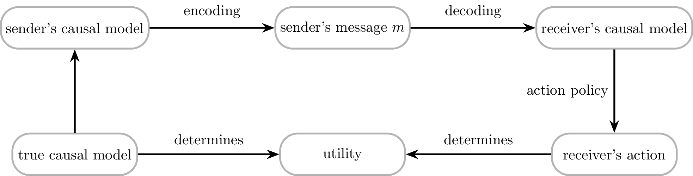
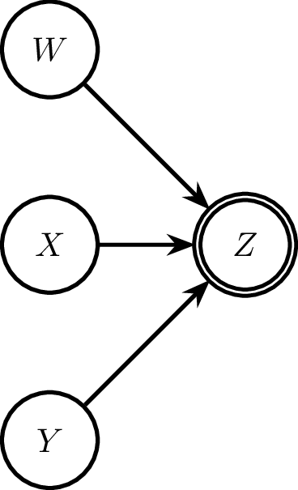
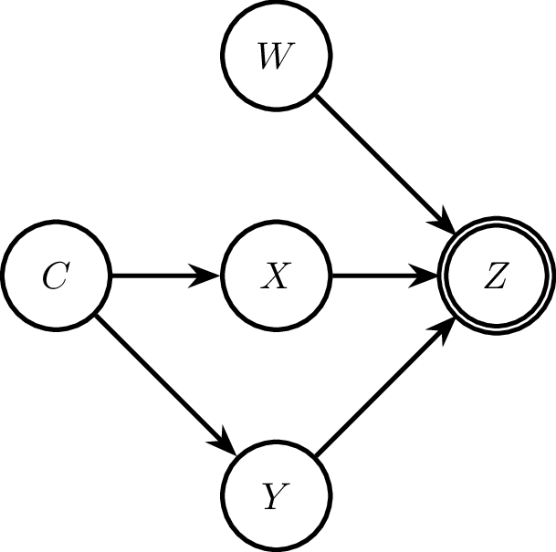

# Conceptual motivation

## Causal talk and optimization

This work treats causal talk — linguistic descriptions of causal relationships — as a form of *optimal compression*.
The framing is analogous to the rate-distortion and information-bottleneck problems in information theory (but the precise model assumed here is not exactly the same): a speaker observing a causal process must encode it into a finite, structured linguistic message, and we ask what message a rational sender should choose.
The core claim is that this choice is governed by a soft-optimization over how much causally relevant information the signal conveys, discounted by the representational cost of the signal.

We work with the simplifying assumption that causal Bayes nets (CBNs) are adequate representations of both the true causal process and agents' mental models thereof. 
The full communicative picture runs: the true causal process shapes the sender's mental model (a CBN), which is compressed into a linguistic signal, which updates the receiver's mental model, which in turn guides the receiver's actions as they engage with the true causal process.



## The sender's linguistic encoding policy

Here, we do not try to provide a general solution for the optimal compression of causal models into linguistic messages, in the sense of providing a theorem of what counts as an optimal message in the above picture of causal information flow through a linguistic channel.
Rather, we take this picture to be the motivating background against which we will explore a specific idea of the speaker's encoding policy.
We test whether this specific picture of linguistic encoding matches the empirically observed human preferences for linguistic expresssions in different (experimental) contexts.

The sender's policy for selecting a message $m$ given a mental model (CBN) is modeled as a soft-max optimization over a causal relevance score:

$$\pi(m \mid \text{CBN}) \propto \exp(\text{causal relevance}(m,\text{CBN}) - \text{cost}(m) - \dots)$$

We take the probability this policy assigns to $m$ — not the underlying mental model itself — to explain human intuitions about preferred causal selection and description.
That is, which causes agents prefer to cite, and how they linguistically frame them, reflects a latent optimization over causal relevance, not a direct readout of the CBN.

## Causal relevance as causal mutual information

We propose that *causal relevance* — the degree to which a cause $C$ matters for an effect $E$ — is well-characterized by *causal mutual information* (cMI).
To begin with, we consider $E$ as the given topic of interest.
The approach can be generalized to include the speaker's choice of which effect to report given an event or which pair cause and even to communicate.
But we don't explore this here.

The main justification is predictive: rankings of causes by cMI align with empirical judgements of causal selection and description across a range of experimental scenarios.

cMI is defined by analogy with standard mutual information, but replaces the observational joint with an interventional one:

$$
cMI(C,E) = \sum_{c,e} \textcolor{#C65353}{Q(C=c)} \ P(E=e \mid do(C=c)) \ \log \frac{P(E=e \mid do(C=c))}{P(E = e)}
$$

For each value $c$, the contribution is the KL divergence between the post-intervention distribution $P(E \mid do(C=c))$ and the unintervened marginal $P(E)$, weighted by a prior $\textcolor{#C65353}{Q(C=c)}$ over interventions.
The *do*-operator cuts all incoming edges to $C$ in the CBN, so the conditional $P(E \mid do(C=c))$ reflects the purely downstream effect of fixing $C=c$, free of confounding.
Standard (observational) MI is recovered when under special conditions, such as when all variables in $C$ are exogenous variables or when $P$ is causally upstream of $C$.


The prior $\textcolor{#C65353}{Q}$ determines how interventions are weighted and has no single canonical choice (see Pocheville et al.
2027). Three salient options from the literature are:

-   **Flat / max-entropy:** $\textcolor{#C65353}{Q(C=c)} = \textcolor{#C65353}{Q(C=c')}$ for all $c, c'$ — all cause values are treated equally, regardless of their natural frequency.
-   **Strongest difference-making / max. specificity:** $\textcolor{#C65353}{Q}$ is chosen to maximize $cI(C,E)$ — focuses weight on the interventions that produce the largest divergence from the baseline effect distribution.
-   **Empirical distribution:** $\textcolor{#C65353}{Q(C=c)} = P(C=c)$ — weights each intervention by how often the cause naturally takes that value.

Here, we will use the intervention prior to implement common assumptions on human (counterfactual) mental sampling, namely that prescriptive norms (Knobe) and what actually happened (Lucas) are taken into account by tendentially upsampling the prescriptively correct and the actual values of relevant variables.

## Causal talk as optimal compression

To make the compression picture concrete, consider a sender whose mental model is a CBN with three cause variables $U$, $X$, $Y$ each contributing to a binary effect $Z$.
The cause variables may be fine-grained — e.g., $X$ ranges over $\{x_1, \ldots, x_n\}$ with $n > 2$ — while $Z$ is binary in the following.
(This is a simplification for illustrative purposes.)

Given that we consider *linguistic encoding*, i.e., the representation of causal information in language, key properties of language itself constrain the medium into which a compressed causal message can be transmitted.
What is important for our concerns here is the observation that natural language expressions are commonly held to have set-theoretic / denotational meanings.
This implies that casual talk likewise carves out a description of the cause space into meaningful subsets.
In this way, the sender's lingusitic encoding task reduces to two coupled choices: 

1.  *which variables to mention* (which is a form of pruning; see below), and 
2.  *which values of each mentioned variable* to treat as the focal cell of a binary partition (a form of lumping).

A causal statement like "$Z=1$ because $X \in \{x_i, x_j\}$ and $Y = y_k$" makes both choices explicit: $U$ is pruned out entirely; $X$ is lumped into two cells $\{x_i, x_j\}$ vs.
its complement; and $Y$ is pinned to the singleton $\{y_k\}$.

Under the sender's policy, the selected (pruning, lumping) combination is the one that maximizes cMI between the compressed description and $Z$, subject to message cost.
This is essentially a rate-distortion problem: maximize the transmitted causal information while respecting the representational budget of the linguistic signal.

Technically, the sender's choice of message can be represented as the choice a latent *compression variable* — placed causally upstream of those variables that are included in the compression.
Concretely, suppose that we want to represent the meaning of "$Z=1$ because $X \in \{x_i, x_j\}$ and $Y = y_k$", then we:

1. sever the connections from all parents of $X$ and $Y$;
2. introduce a new parent variable (the compression variable $C$) which implements the (binary, nomological) relationship of belonging to the state described by the expression "$X \in \{x_i, x_j\}$ and $Y = y_k$" or not;
3. compute the causal mutual information (which now reduces to the mutual information!) between $C$ and the effect variable.

As the last step, essentially marginalizes over all other variables and values, we can think of this as a compression, obtained by pruning and lumping of variables to result in a very condensed CBN representation that only contains $C$ and $Z$. 
This is also illustrated in the pictures below (and it is exactly what's implemented in the code base (see followin sections)):

::: {#fig-compression layout="[2,3,2]" layout-valign="center" style="column-gap: 2em;"}
{#fig-comp-a}

{#fig-comp-b}

{#fig-comp-c}

Causal compression in three steps.
:::

The listener's working mental model is then the last picture in this sequence: a single upstream compression node causing $Z$ directly, bypassing the fine-grained cause structure.
This compressed model is adequate for downstream decision-making precisely to the extent that the message has preserved the causally relevant information about $Z$ — i.e., to the extent that cMI is high.

# Code & examples

To explore the predictions of this approach, there is a code base which covers many basic cases (but not yet everything). 
The following introduces the basic functionality and showcases some examples.

## Causal Bayes nets

```{r}
#| message: false
source("causal-relevance.R")
```

A CBN is created by supplying named vectors of prior probabilities for exogenous (root) variables and conditional probability tables (CPTs) as data-frames for each endogenous variable.
CPT column names determine the DAG structure automatically: every column other than the variable itself and `prob` is treated as a parent.

```{r}
net <- CBN(
  exogenous = list(
    Rain   = c(yes = 0.3, no = 0.7),
    Sprink = c(yes = 0.4, no = 0.6)
  ),
  endogenous = list(
    Wet = tribble(
      ~Rain,  ~Sprink,  ~Wet,   ~prob,
      "yes",  "yes",    "yes",   1.00,
      "yes",  "yes",    "no",    0.00,
      "yes",  "no",     "yes",   0.90,
      "yes",  "no",     "no",    0.10,
      "no",   "yes",    "yes",   0.80,
      "no",   "yes",    "no",    0.20,
      "no",   "no",     "yes",   0.10,
      "no",   "no",     "no",    0.90
    )
  )
)

print(net)
```

**Computing joint probability tables.** `joint()` returns the full joint distribution or a marginal over a specified subset of variables. Bayesian conditioning is supported via the `cond` argument.

```{r}
joint(net)                              # full joint: Rain × Sprink × Wet
joint(net, vars = c("Rain", "Wet"))     # marginal over Rain and Wet
joint(net, vars = "Wet")               # marginal: P(Wet)

# P(Wet | Rain = yes)
joint(net, vars = "Wet", cond = list(Rain = "yes"))

# P(Wet | Rain ∈ {yes})  — identical, illustrating multi-value conditioning syntax
joint(net, vars = "Wet", cond = list(Rain = c("yes", "no")))
```

**Interventions.** There are three use cases, all via `intervene()`:

```{r}
# Use case 1 — standard hard do-intervention: pin Rain to "yes"
net_do_hard <- intervene(net, c(Rain = "yes"))
print(net_do_hard)

# Use case 2 — soft intervention: free Rain from its structural causes,
#              keep a (non-degenerate) intervention prior
#              w/  default as the marginal distribution (or set it to flat/uniform)
net_do_soft  <- intervene(net, "Rain", prior = "marginal")
print(net_do_soft)
net_do_flat  <- intervene(net, "Rain", prior = "flat")
print(net_do_flat)

# Use case 3 — set-level / partitioned intervention:
#   introduce a binary 'partition' variable (1 = Rain ∈ focal set, 0 = otherwise)
#   with a flat prior over the two cells
net_do_part <- intervene(net, list(Rain = c("yes")), prior = "flat")
print(net_do_part)
joint(net_do_part, vars = c("partition", "Wet"))
```

**Updating priors.** `changePrior()` updates exogenous or intervened-variable priors, including a *propensity* mode that mixes a degenerate (point-mass) prior at a focal value with the existing prior — useful for modeling a bias toward the actual (or counterfactual) cause.

```{r}
# propensity = 0.8: new prior = 0.8 × δ(Rain=yes) + 0.2 × old prior
net_biased <- changePrior(net_do_soft, list(Rain = "yes"), propensity = 0.8)
joint(net_biased, vars = "Rain")
```

## Causal mutual information

`MI(net, x_var, y_var)` computes $I(X; Y)$ from the marginal joint probability table of the CBN, with a conventional `0 log 0 = 0`. `cMI()` wraps `intervene()` followed by `MI()`: it performs a do-intervention on the cause and returns $I(\text{cause}; \text{effect})$ under the intervened model.

For set-level interventions (use case 3), the cause variable is the `partition` node, so `cMI()` returns $I(\text{partition}; E)$, the mutual information between the binary partition of cause values and the effect. This quantity measures how much causal information the specific lumping (partition) conveys about the effect under a flat prior over partition cells.

```{r}
# Whole-variable causal MI: how much does Rain (freely randomized) tell us about Wet?
cMI(net, "Rain", "Wet", prior = "flat")

# Set-level causal MI: how much does knowing Rain ∈ {yes} vs. Rain ∉ {yes} tell us?
cMI(net, list(Rain = c("yes")), "Wet", prior = "flat")
```


## Examples

### Sohpie's pecking

Sophie's pecking (Yablo's proportionality scenario).** The causal scenario involves a pigeon Sophie who pecks at a key whenever the key is red. There are four possible color states: `R1` (a specific shade of red), `R2` (another red shade), `B1`, `B2` (two blue shades). Sophie pecks iff the state is red (`R1` or `R2`).

We compare two potential causal descriptions:

-   **P1** — "the key was specifically R1": focal set `{R1}`
-   **P2** — "the key was red": focal set `{R1, R2}`

```{r}
net_peck <- CBN(
  exogenous = list(
    C = c(R1 = 0.25, R2 = 0.25, B1 = 0.25, B2 = 0.25)
  ),
  endogenous = list(
    P = tribble(
      ~C,    ~P,       ~prob,
      "R1",  "peck",    1,
      "R1",  "abstain", 0,
      "R2",  "peck",    1,
      "R2",  "abstain", 0,
      "B1",  "peck",    0,
      "B1",  "abstain", 1,
      "B2",  "peck",    0,
      "B2",  "abstain", 1
    )
  )
)

# cMI for "is specifically R1" — overly specific description
cMI(net_peck, list(C = c("R1")),        "P", prior = "flat")

# cMI for "is red" — proportional description
cMI(net_peck, list(C = c("R1", "R2")), "P", prior = "flat")
```

The partition `{R1, R2}` vs `{B1, B2}` is perfectly informative about the effect (pecking iff red), yielding $I(\text{partition}; P) = \log 2 \approx 0.693$ nats — the maximum for a binary partition. The overly specific partition `{R1}` vs `{R1}^c` mixes red and blue states in the complement cell, so the partition is less informative: $I < \log 2$. This operationalizes *proportionality*: the more coarse-grained but sufficient description ("red") is causally more relevant than the unnecessarily fine-grained one ("specifically R1").

Using our probabilistic speaker policy we can see that the speaker would prefer the proportional description over the overly specific one, as it maximizes the causal mutual information with the effect.

```{r}
# speaker policy of the Sohpie's pecking case
cMIs_peck <- c(
  "red"     = cMI(net_peck, list("C" = c("R1", "R2")), "P", prior = "flat"),
  "scarlet" = cMI(net_peck, list("C" = c("R1")), "P", prior = "flat")
)
speaker(cMIs_peck, alpha=5)
```


### Urn example: conjunctive vs. disjunctive causal rules

Two urns are drawn from simultaneously. U1 draws red with probability 0.8, U2 draws red with probability 0.2. The outcome depends on both draws: under a **conjunctive** rule the player wins iff *both* draw red; under a **disjunctive** rule the player wins iff *at least one* draws red. The actual outcome is that both urns drew red. Which urn caused the win?

We model the actual outcome using `changePrior` with `propensity = 0.5`, which mixes the background prior halfway toward a point mass on the actual value — reflecting that the actual draw is more likely than base rates alone would suggest.

```{r}
net_conj <- CBN(
  exogenous = list(
    "U1" = c("red" = 0.8, "blue" = 0.2),
    "U2" = c("red" = 0.2, "blue" = 0.8)
  ),
  endogenous = list(
    "win" = tribble(
      ~U1    , ~U2    , ~win , ~prob,
      "red"  , "red"  ,    1 ,     1,
      "red"  , "blue" ,    1 ,     0,
      "blue" , "red"  ,    1 ,     0,
      "blue" , "blue" ,    1 ,     0,
      "red"  , "red"  ,    0 ,     0,
      "red"  , "blue" ,    0 ,     1,
      "blue" , "red"  ,    0 ,     1,
      "blue" , "blue" ,    0 ,     1
    )
  )
)

net_conj_updated <- changePrior(
  net_conj,
  list(U1 = "red", U2 = "red"),
  propensity = 0.5
)

cMIS_conj <- c(
  "U1-red" = cMI(net_conj_updated, list("U1" = "red"), "win", prior = "marginal"),
  "U2-red" = cMI(net_conj_updated, list("U2" = "red"), "win", prior = "marginal"),
  "both"   = cMI(net_conj_updated, list("U1" = "red", "U2" = "red"), "win", prior = "marginal")
)

speaker(cMIS_conj, alpha = 5)
```

Under the conjunctive rule, winning requires *both* draws to be red. U1 draws red 80% of the time and is relatively reliable; U2 draws red only 20% of the time and is the bottleneck. Intervening on U2's value therefore produces the larger swing in win probability, so U2 carries more causal information and the speaker prefers to cite it.

```{r}
net_disj <- CBN(
  exogenous = list(
    "U1" = c("red" = 0.8, "blue" = 0.2),
    "U2" = c("red" = 0.2, "blue" = 0.8)
  ),
  endogenous = list(
    "win" = tribble(
      ~U1    , ~U2    , ~win , ~prob,
      "red"  , "red"  ,    1 ,     1,
      "red"  , "blue" ,    1 ,     1,
      "blue" , "red"  ,    1 ,     1,
      "blue" , "blue" ,    1 ,     0,
      "red"  , "red"  ,    0 ,     0,
      "red"  , "blue" ,    0 ,     0,
      "blue" , "red"  ,    0 ,     0,
      "blue" , "blue" ,    0 ,     1
    )
  )
)

net_disj_updated <- changePrior(
  net_disj,
  list(U1 = "red", U2 = "red"),
  propensity = 0.5
)

cMIS_disj <- c(
  "U1-red" = cMI(net_disj_updated, list("U1" = "red"), "win", prior = "marginal"),
  "U2-red" = cMI(net_disj_updated, list("U2" = "red"), "win", prior = "marginal"),
  "both"   = cMI(net_disj_updated, list("U1" = "red", "U2" = "red"), "win", prior = "marginal")
)

speaker(cMIS_disj, alpha = 5)
```

Under the disjunctive rule the logic reverses. Winning requires only one red draw, and U1 almost always obliges (80%). The outcome is therefore nearly guaranteed by U1 alone — it is U2's rare red draw that produces any remaining uncertainty. The speaker now prefers to cite U2, whose deviation from its typical blue value is the informative event.

### Causal chain

A variable $X$ causes two intermediate variables $Y_1$ and $Y_2$, which jointly determine the effect $Z$. All variables are binary. The prior over $X$ is flat; each of $Y_1$ and $Y_2$ is 1 with probability 0.8 when $X=1$ and 0.2 when $X=0$; $Z=1$ with probability 0.9 iff both $Y_1=1$ and $Y_2=1$, and 0 otherwise.

We compare three possible causal statements about why $Z=1$: citing the distal cause ($X=1$), one proximal cause ($Y_1=1$), or both proximal causes ($Y_1=1$ and $Y_2=1$).

```{r}
net_chain <- CBN(
  exogenous = list(
    X = c("1" = 0.5, "0" = 0.5)
  ),
  endogenous = list(
    Y1 = tribble(
      ~X,   ~Y1,  ~prob,
      "1",  "1",   0.8,
      "1",  "0",   0.2,
      "0",  "1",   0.2,
      "0",  "0",   0.8
    ),
    Y2 = tribble(
      ~X,   ~Y2,  ~prob,
      "1",  "1",   0.8,
      "1",  "0",   0.2,
      "0",  "1",   0.2,
      "0",  "0",   0.8
    ),
    Z = tribble(
      ~Y1,  ~Y2,  ~Z,   ~prob,
      "1",  "1",  "1",   0.9,
      "1",  "1",  "0",   0.1,
      "1",  "0",  "1",   0.0,
      "1",  "0",  "0",   1.0,
      "0",  "1",  "1",   0.0,
      "0",  "1",  "0",   1.0,
      "0",  "0",  "1",   0.0,
      "0",  "0",  "0",   1.0
    )
  )
)

cMIs_chain <- c(
  "X=1" = cMI(net_chain, list("X"  = "1"), "Z", prior = "marginal"),
  "Y1=1" = cMI(net_chain, list("Y1" = "1"), "Z", prior = "marginal"),
  "Y1=1, Y2=1"  = cMI(net_chain, list("Y1" = "1", "Y2" = "1"), "Z", prior = "marginal")
)

speaker(cMIs_chain, alpha = 5)
```

Citing both proximal causes ($Y_1=1$ and $Y_2=1$) is the most informative message: together they are nearly sufficient for $Z=1$ (probability 0.9), so the joint intervention pins the effect distribution tightly. Citing only $Y_1=1$ is less informative because $Y_2$ remains free and may be 0. The distal cause $X=1$ is the least specific — it raises the probability of each $Y$ being 1 but leaves two steps of uncertainty between cause and effect. The speaker therefore prefers the conjunctive proximal description.


# Open issues

- cMI is symmetric; for Sohpie's pecking the sentence "Sohpie pecked because the key was blue" is exactly as causally relevant as "Sophie pecked because the key was red"; we need to add constraints to the speaker's policy to guardrail for this

- approach with the compression variable doesn't cover all linguistically cases neatly; think "Z=1 because most of Y_i=1"

- the `propensity` parameter is currrently not implemented for the `cMI` pipeline

# Extensions & follow-ups

-   more examples:

    -   causal chains

-   more measures:

    -   CESM

    -   sufficiency-necessity

-   general results:

    - prove optimality for binary variable case in logical network

- explore listener inferences: what could a listener infer from a causal statements based on the given speaker model?
